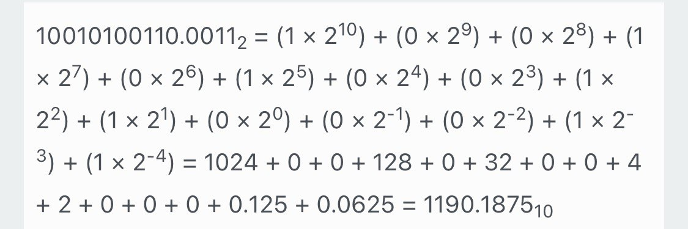
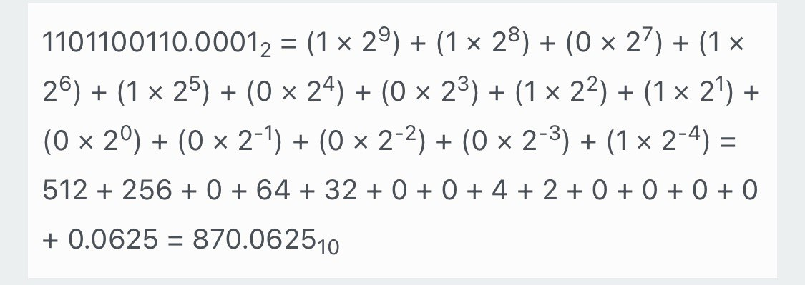
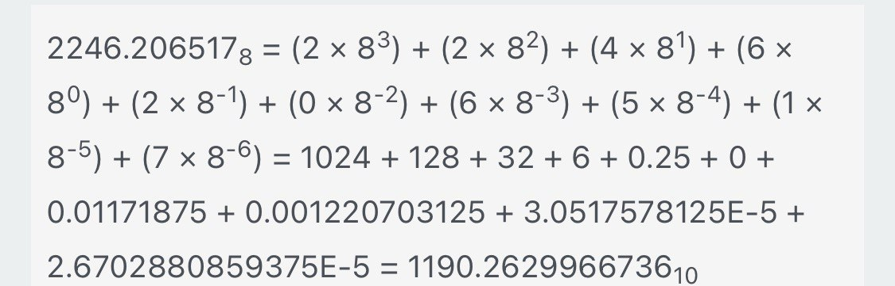
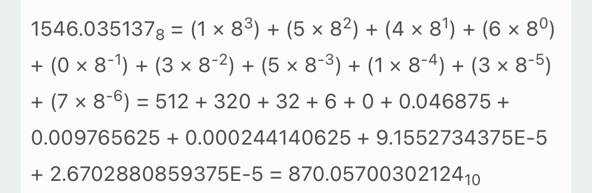
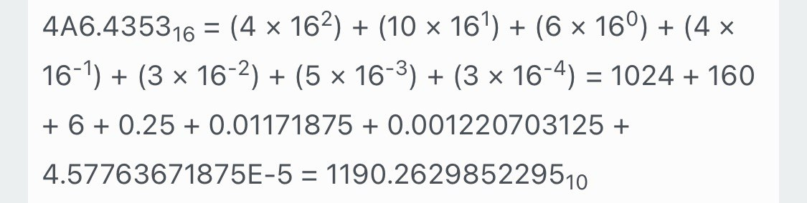
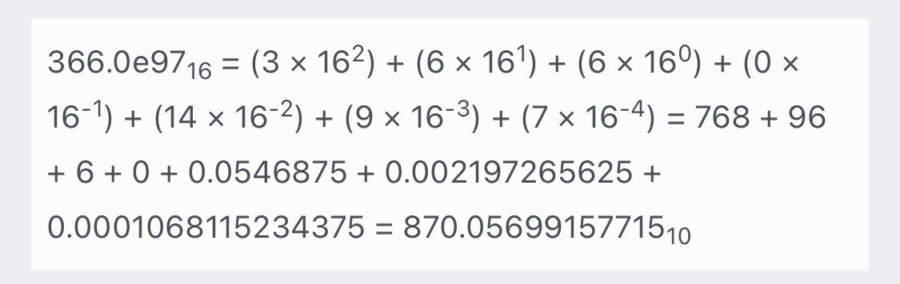

# 1
K = 00  
C = 1000 + 3*(00 + 10) = 1030  
D = 100 + 6*(00 + 10) = 160  
A = 1030.16  
B = 160.103  
## Перевод в двоичную числа А
Сначала делим на 2, пока целая часть не равна 0:

|Деление|Целое частное|Остаток|
|---|---|---|
|1030 / 2|515|0|
|515 / 2|257|1|
|257 / 2|128|1|
|128 / 2|64|0|
|64 / 2|32|0|
|32 / 2|16|0|
|16 / 2|8|0|
|8 / 2|4|0|
|4 / 2|2|0|
|2 / 2|1|0|
|1 / 2|0|1|

Теперь десятичная часть, умножаем 0.16 на 2, пока целая часть не равна 1:

|Умножение|Результат|Целая часть|Остаток|
|---|---|---|---|
|0.160 × 2|0.32|0|0.32|
|0.32 × 2|0.64|0|0.64|
|0.64 × 2|1.28|1|0.28|

Получается А = 10000000110.001 в двоичной. 

## Перевод числа B в двоичную
|Деление|Целое частное|Остаток|
|---|---|---|
|160 / 2|80|0|
|80 / 2|40|0|
|40 / 2|20|0|
|20 / 2|10|0|
|10 / 2|5|0|
|5 / 2|2|1|
|2 / 2|1|0|
|1 / 2|0|1|

|Умножение|Результат|Целая часть|Остаток|
|---|---|---|---|
|0.103 × 2|0.206|0|0.206|
|0.206 × 2|0.412|0|0.412|
|0.412 × 2|0.824|0|0.824|
|0.824 × 2|1.648|1|0.648|

Получаем B = 10100000.0001

### А в 8ой системе:

|Деление|Целое частное|Остаток|
|---|---|---|
|1030 / 8|128|6|
|128 / 8|16|0|
|16 / 8|2|0|
|2 / 8|0|2|

|Умножение|Результат|Целая часть|Остаток|
|---|---|---|---|
|0.16 × 8|1.28|1|0.28|
|0.28 × 8|2.24|2|0.24|
|0.24 × 8|1.92|1|0.92|
|0.92 × 8|7.36|7|0.36|
|0.36 × 8|2.88|2|0.88|
|0.88 × 8|7.04|7|0.04|
|0.04 × 8|0.32|0|0.32|

A = 2006.121727

### В в 8ой системе:
|Деление|Целое частное|Остаток|
|---|---|---|
|160 / 8|20|0|
|20 / 8|2|4|
|2 / 8|0|2|

|Умножение|Результат|Целая часть|Остаток|
|---|---|---|---|
|0.103 × 8|0.824|0|0.824|
|0.824 × 8|6.592|6|0.592|
|0.592 × 8|4.736|4|0.736|
|0.736 × 8|5.888|5|0.888|
|0.888 × 8|7.104|7|0.104|
|0.104 × 8|0.832|0|0.832|

B = 240.06457

### A в 16ой
|Деление|Целое частное|Остаток|
|---|---|---|
|1030 / 16|64|6|
|64 / 16|4|0|
|4 / 16|0|4|

|Умножение|Результат|Целая часть|Остаток|
|---|---|---|---|
|0.16 × 16|2.56|2|0.56|
|0.56 × 16|8.96|8|0.96|
|0.96 × 16|15.36|15 → F|0.36|
|0.36 × 16|5.76|5|0.76|

A = 406.28F5
### B в 16ой

|Деление|Целое частное|Остаток|
|---|---|---|
|160 / 16|10|0|
|10 / 16|0|10 → A|

|Умножение|Результат|Целая часть|Остаток|
|---|---|---|---|
|0.103 × 16|1.648|1|0.648|
|0.648 × 16|10.368|10 → A|0.368|
|0.368 × 16|5.888|5|0.888|
|0.888 × 16|14.208|14 → E|0.208|

B = A0.1A5E
# 2 
## A + B, A - B в 2ой

10000000110.0010 +  
10100000.0001 =  
**10010100110.0011**

10000000110.0010 -  
10100000.0001 =  
**1101100110.0001**

## в 8ой
Запиши также в столбик, лень писать, ответ на сложение
2246.206517
На вычитание
1546.035137

## в 16ой
Сложение:
4a6.4353
Вычитание:
366.0e97

# 3
## в 2ой A + B и A - B в 10ю

## в 8ой

## в 16ой

Напиши, что типа вот точность получилась наибольшая в случае 16ой СС, потому что взяли больше знаков после запятой. Но результаты как видно везде правильные.